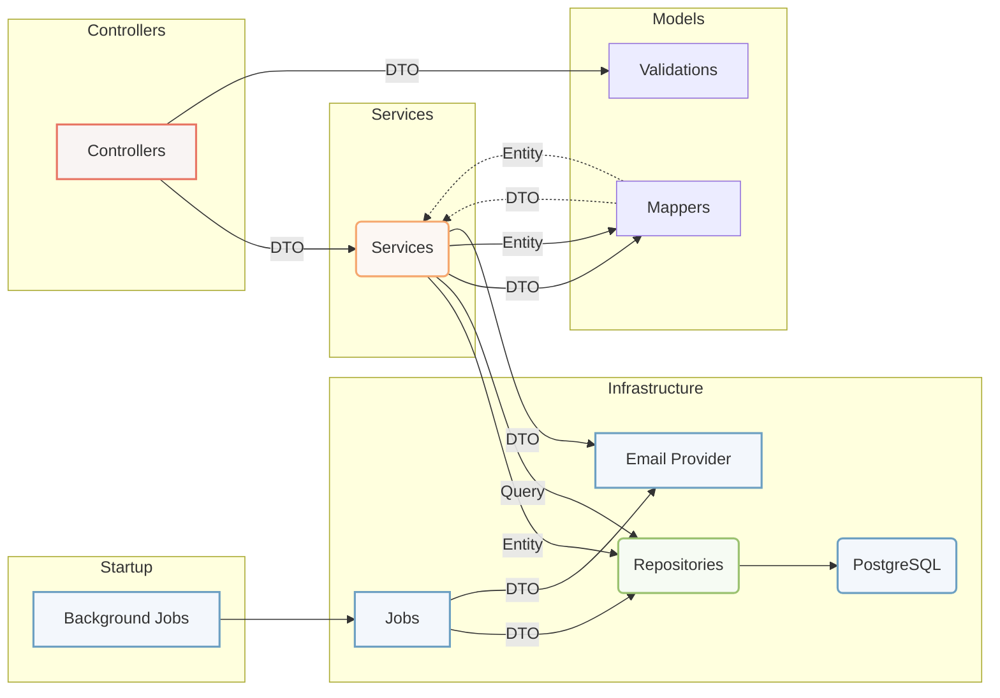

# Manual do Desenvolvedor: Aplicação .NET Core com Entity Framework e PostgreSQL
Este manual do desenvolvedor fornece uma visão geral da estrutura de pastas e principais componentes de uma aplicação .NET Core que utiliza o Entity Framework (EF) e o PostgreSQL como banco de dados. A aplicação é uma API REST que gerencia alunos, professores, cursos e projetos de um programa de pós-graduação. A autenticação e autorização são baseadas em JSON Web Tokens (JWT) e roles. A aplicação também inclui jobs diários para enviar e-mails aos alunos que estão concluindo seus cursos.

## Estrutura de Pastas
A aplicação segue uma hierarquia de pastas estruturada. Aqui está uma visão geral das principais pastas e arquivos:
```
- appsettings.Development.json
- appsettings.json
- Controllers/              # Contém controladores de API para cada entidade
- docker-compose.yaml       # Configuração do Docker Compose
- Dockerfile                # Dockerfile para a construção da aplicação
- gerdisc.csproj            # Arquivo de projeto
- gerdisc.sln               # Arquivo de solução
- Infrastructure/           # Contém vários componentes relacionados à infraestrutura
  - Extensions/             # Métodos de extensão e utilidades
  - Jobs/                   # Jobs em segundo plano (por exemplo, StudentsFinishing) usando o Hangfire
  - Repositories/           # Repositórios de acesso a dados
  - Validations/            # Atributos de validação personalizados
- Migrations/               # Migrações de banco de dados do EF
- Models/                   # Objetos de transferência de dados (DTOs), entidades, enums e mappers
- Properties/               # Propriedades relacionadas à configuração e segurança
- Services/                 # Serviços de lógica de negócio
  - Interfaces/             # Interfaces de serviço
- Settings/                 # Configurações da aplicação
- Startup.cs                # Configuração de inicialização da aplicação
```

## Principais Componentes

### Controllers
Os controladores de API são responsáveis por receber as requisições HTTP e retornar as respostas adequadas. Cada controlador é responsável por lidar com as operações relacionadas a uma entidade específica, como CRUD (criar, ler, atualizar, excluir) e outras operações personalizadas. Eles se comunicam com os serviços correspondentes para executar as operações necessárias nos dados.
A pasta `Controllers` contém controladores de API responsáveis por lidar com as requisições e respostas HTTP para cada entidade. Aqui está um exemplo dos controladores disponíveis:

- CourseController
- DissertationController
- ExtensionController
- ExternalResearcherController
- ProfessorController
- ProjectController
- StudentController
- UserController

### Infrastructure
A pasta `Infrastructure` contém diversos componentes essenciais para o funcionamento da aplicação.
- Extensions: Essa pasta contém métodos de extensão e utilidades que são usados em toda a aplicação para adicionar funcionalidades extras, lidar com conversões de tipos, formatações de data, manipulação de strings e muito mais.
- Jobs: A pasta `Jobs` contém os jobs em segundo plano implementados utilizando o Hangfire. Esses jobs são responsáveis por executar tarefas agendadas ou em intervalos regulares. No exemplo mencionado, o job StudentsFinishing é executado diariamente para enviar e-mails aos alunos que estão concluindo seus cursos. Esses jobs podem ser configurados para executar em um servidor separado ou dentro da própria aplicação.
- Repositories: A pasta `Repositories` contém os repositórios de acesso a dados para cada entidade. Os repositórios são responsáveis por interagir com o banco de dados e realizar operações de consulta e persistência de dados. Eles implementam o padrão de repositório, abstraindo os detalhes do acesso ao banco de dados e fornecendo uma interface comum para a camada de serviços.
- Validations: A pasta `Validations` contém atributos de validação personalizados que são utilizados para validar as entradas recebidas pela aplicação. Por exemplo, os atributos `ValidCpfAttribute` e `ValidEmailAttribute` podem ser aplicados a propriedades em modelos de dados para garantir que o CPF e o e-mail estejam em um formato válido antes de serem persistidos no banco de dados.

### Migrations
A pasta `Migrations` contém os arquivos de migração do banco de dados do Entity Framework. As migrações são usadas para refletir as alterações no modelo de banco de dados ao longo do tempo, permitindo a evolução do esquema do banco de dados de forma controlada. Cada migração representa uma etapa no histórico de alterações do banco de dados e é responsável por atualizar ou reverter o esquema do banco de dados para corresponder à versão atual do aplicativo.

### Models
A pasta `Models` contém diferentes tipos de classes que são usadas para representar os dados na aplicação.

- DTOs: Os objetos de transferência de dados (DTOs) são classes que representam os dados transferidos entre a API e o cliente. Eles geralmente contêm apenas as propriedades relevantes para a comunicação e podem ser mapeados a partir das entidades do banco de dados.
- Entities: As entidades representam as tabelas do banco de dados e são mapeadas para classes no código. Elas contêm propriedades que correspondem aos campos da tabela e podem ter relacionamentos com outras entidades.
- Enums: Enums são usados para representar valores fixos que podem ser atribuídos a propriedades em entidades ou DTOs. Por exemplo, um enum pode representar os diferentes status de um projeto ou o tipo de usuário.
- Mapper: Mappers: Os mappers são responsáveis por converter objetos DTO em entidades e vice-versa. Eles facilitam a transferência de dados entre as camadas da aplicação, abstraindo a lógica de mapeamento e simplificando o código.

### Services
Os serviços são responsáveis por implementar a lógica de negócio da aplicação. Eles contêm métodos para realizar operações relacionadas a uma entidade específica, como criação, leitura, atualização e exclusão de registros. Os serviços podem depender dos repositórios para acessar os dados do banco de dados e podem ser injetados em controllers da aplicação.

- Interfaces: Contém interfaces dos serviços para facilitar a injeção de dependência.

### Settings
A pasta `Settings` contém as configurações da aplicação. Os arquivos de configuração, como `appsettings.json`, fornecem valores que podem ser ajustados para diferentes ambientes, como desenvolvimento, teste e produção. Essas configurações incluem informações como a conexão com o banco de dados, chaves de API, configurações de autenticação, etc. Separar as configurações em arquivos externos permite que a aplicação seja configurada de forma flexível e evita que informações sensíveis sejam armazenadas no código fonte.

## Fluxo de Desenvolvimento
Para trabalhar efetivamente neste projeto, siga estas etapas:

1. Clone o repositório do projeto.
1. Certifique-se de ter as dependências necessárias instaladas: .NET Core SDK, PostgreSQL, Docker, etc.
1. Revise a base de código existente e entenda a estrutura de pastas e os principais componentes.
1. Faça quaisquer alterações ou adições necessárias à base de código existente para implementar novos recursos ou corrigir problemas.
1. Teste suas alterações localmente, garantindo que a funcionalidade existente permaneça intacta.
1. Escreva novos testes ou atualize os testes existentes para cobrir suas alterações.
1. Use o Dockerfile e docker-compose.yaml fornecidos para criar e executar a aplicação em um ambiente de contêiner.
1. Implante a aplicação em um ambiente adequado, seguindo as melhores práticas de implantação.
1. Monitore e mantenha a aplicação em produção, garantindo sua estabilidade e desempenho.
1. Documente suas alterações e atualizações na base de código, incluindo comentários, mensagens de commit e descrições de pull requests.


